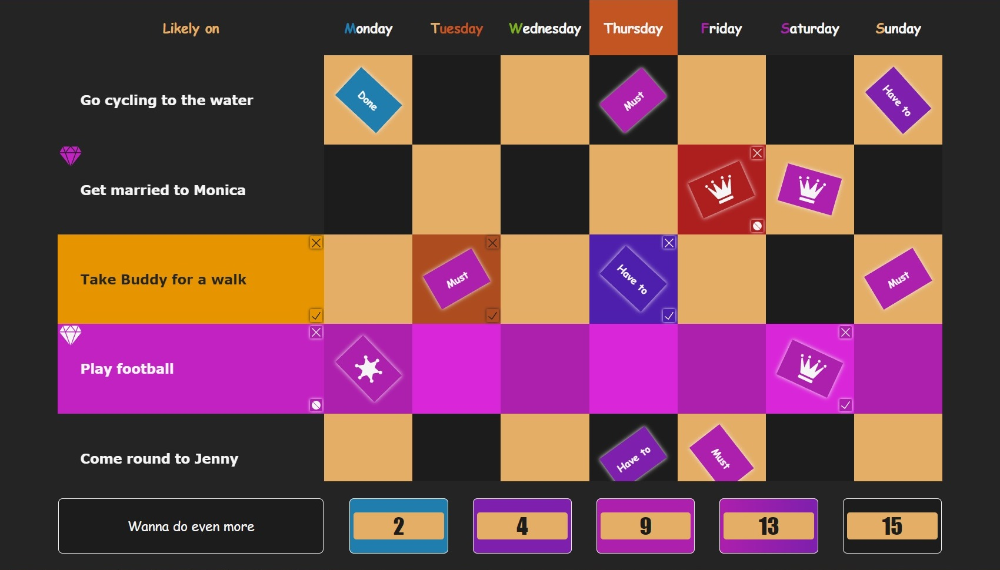
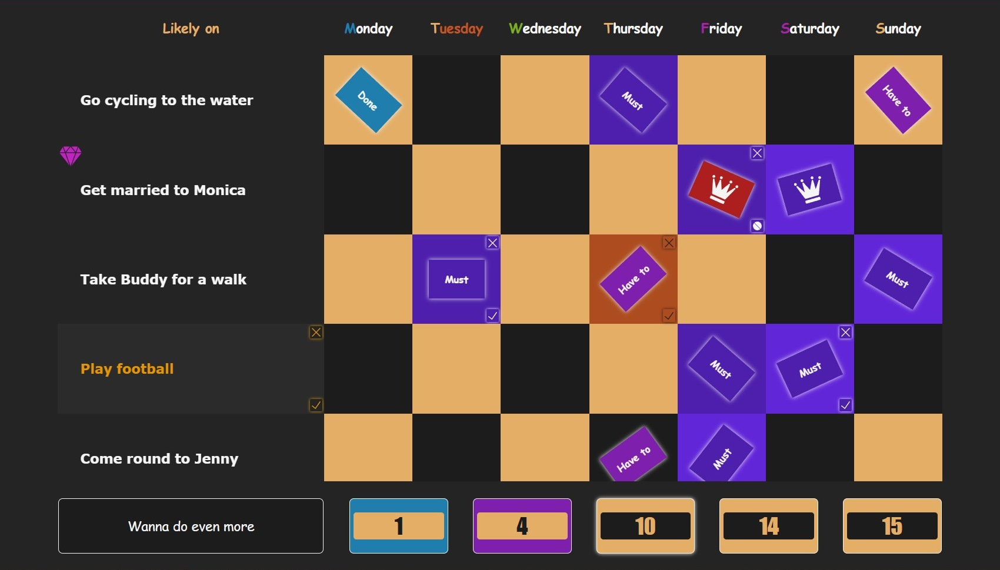
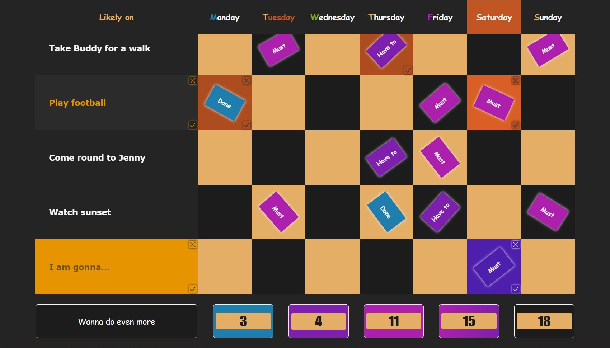
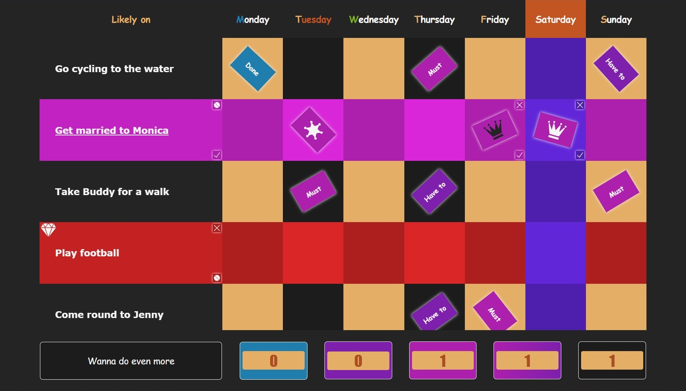
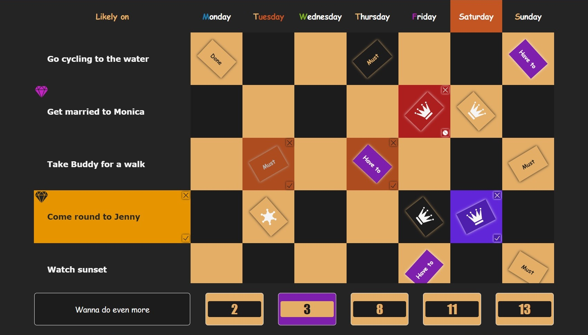
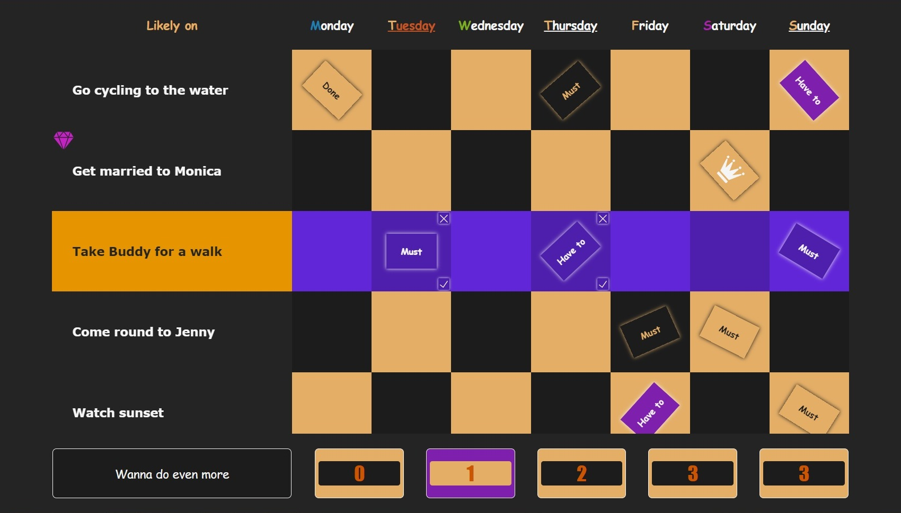

[][1]

# Activity Table - change your life for the better!

## Contents

* **[Welcome](#1)**
* **[Activity: Must, Have to, Done](#2)**
* **[Super Activity: Super Must, Super Done](#3)**
* **[Button - Counters](#4)**
* **[P.S.](#5)**

## About

### <a id="1">Welcome</a>

**Welcome** to an absolutely fabulous world of careful planning, full implementation and thorough enjoyment. This app is supposed to help you vividly visualize and neatly arrange a whole lot of fun activities you would like to do on your screen.

[][1]

### <a id="2">Activity: Must, Have to, Done</a>

You are offered to use two kinds of marks **'Must'** and **'Have to'** depending on how strong you feel about a particular activity on a particular day, plus one additional **'Done'** mark for something you have done should you need to keep your achievement in the table. To edit table cells such as mark cells or description cells, if possible, just give them a double click.

[][1]

### <a id="3">Super Activity: Super Must, Super Done</a>

But if you feel something really great is going to be happening, do not hesitate and transform the activity into super one. To do so give a double click to its description while it is editable. When in super mode you are offered to use **'Super Must'** marks **(The Crown)** for super actions and **'Super Done'** marks **(The Sheriff Star)** should you wish to mark your achievement as a milestone in your life.

**Note 1:** When transforming into super mode **'Have to'** marks turn into **'Super Must'** marks, temporarily shown as **black crowns**.

**Note 2:** You erase super marks in the same way as you do with ordinary activities.

**Note 3:** You can remove a whole super activity as long as it is completely empty of any super marks.

[][1]

### <a id="4">Button - Counters</a>

Click on the **buttons** at the bottom to tarnish corresponding types of the marks in order to be able to easily focus on important things at the moment. You are having a particular group of the marks highlighted while keeping the cursor over the button. The **counters** show how many marks you have got in an activity, on a day or in total.

[][1]

### <a id="5">P.S.</a>

The **different colours** to the days are not coincidental and done on purpose to help you immediately understand what kind of day it structurally is.

[][1]

[Have a glance at the demo example.][1]

## by

*[PapaProger](https://github.com/papaproger)*, first demo upload on 02.10.2022. Copyright © 2022 Sergey Shlyakhtin. All rights reserved.

[1]: https://papaproger.github.io/activitytable/